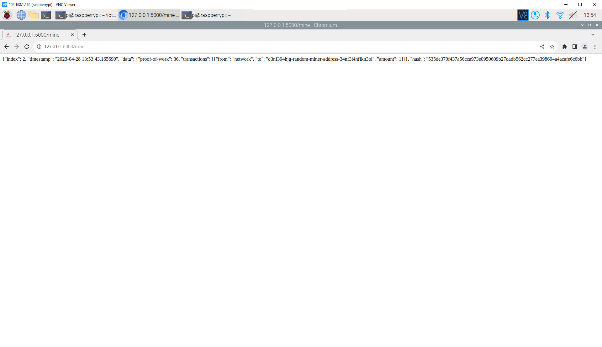
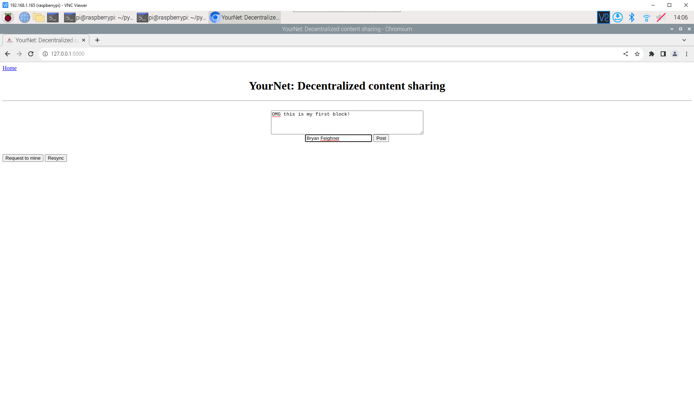

# Lab 10
## Run hash_value.py twice
In this section we will be comparing the two outputs of the hashing algorithm supplied.
```
pi@raspberrypi:~ $ cd iot/
pi@raspberrypi:~/iot $ cd lesson10/
pi@raspberrypi:~/iot/lesson10 $ cat hash_value.py 
"""
https://docs.python.org/3/using/cmdline.html#envvar-PYTHONHASHSEED
If PYTHONHASHSEED is not set or set to random, a random value is used to to seed the hashes of str and bytes objects.
If PYTHONHASHSEED is set to an integer value, it is used as a fixed seed for generating the hash() of the types covered by the hash randomization.
Its purpose is to allow repeatable hashing, such as for selftests for the interpreter itself, or to allow a cluster of python processes to share hash values.
The integer must be a decimal number in the range [0,4294967295]. Specifying the value 0 will disable hash randomization.

https://www.programiz.com/python-programming/methods/built-in/hash
hash(object) returns the hash value of the object (if it has one). Hash values are integers.
They are used to quickly compare dictionary keys during a dictionary lookup.
Numeric values that compare equal have the same hash value even if they are of different types, as is the case for 1 and 1.0.
For objects with custom __hash__() methods, note that hash() truncates the return value based on the bit width of the host machine.
"""

# hash for integer unchanged
print('The hash for 1 is:', hash(1))

# hash for decimal
print('The hash for 1.0 is:',hash(1.0))
print('The hash for 3.14 is:',hash(3.14))

# hash for string
print('The hash for Python is:', hash('Python'))

# hash for a tuple of vowels
vowels = ('a', 'e', 'i', 'o', 'u')
print('The hash for a tuple of vowels is:', hash(vowels))

# hash for a custom object
class Person:
    def __init__(self, age, name):
        self.age = age
        self.name = name
    def __eq__(self, other):
        return self.age == other.age and self.name == other.name
    def __hash__(self):
        return hash((self.age, self.name))
person = Person(23, 'Adam')
print('The hash for an object of person is:', hash(person))
pi@raspberrypi:~/iot/lesson10 $ python3 hash_value.py 
The hash for 1 is: 1
The hash for 1.0 is: 1
The hash for 3.14 is: 322818021289917443
The hash for Python is: 8386836988663938715
The hash for a tuple of vowels is: -6383910483621438921
The hash for an object of person is: -345019248133906988
pi@raspberrypi:~/iot/lesson10 $ python3 hash_value.py 
The hash for 1 is: 1
The hash for 1.0 is: 1
The hash for 3.14 is: 322818021289917443
The hash for Python is: 4181409961572195545
The hash for a tuple of vowels is: -1073711024687736065
The hash for an object of person is: 5115191848998731132
```
Here we can see two hash values are different for the lower 3 variables, Python, "a tuple of vowels" and and a person().
## SHA-2 Secure Hash Algorithm
Here we use the python 3 console to generate a 256 bit, 32 byte SHA-256 hash. 
```
pi@raspberrypi:~/iot/lesson10 $ python3
Python 3.9.2 (default, Feb 28 2021, 17:03:44) 
[GCC 10.2.1 20210110] on linux
Type "help", "copyright", "credits" or "license" for more information.
>>> import hashlib
>>> m = hashlib.sha256(b"hello, world")
>>> m.hexdigest()
'09ca7e4eaa6e8ae9c7d261167129184883644d07dfba7cbfbc4c8a2e08360d5b'
>>> m.digest_size
32
>>> m.block_size
64
>>> exit()
```
We can see that the hash created has a size of 32 bytes and a block size of 64 bits
## Tiniest Blockchain
```
pi@raspberrypi:~/iot/lesson10 $ cat snakecoin.py
# Gerald Nash, "Let's build the tiniest blockchain in less than 50 lines of Python"
import hashlib as hasher
import datetime as date

# Define what a Snakecoin block is
class Block:
  def __init__(self, index, timestamp, data, previous_hash):
    self.index = index
    self.timestamp = timestamp
    self.data = data
    self.previous_hash = previous_hash
    self.hash = self.hash_block()
  
  def hash_block(self):
    sha = hasher.sha256()
    sha.update(str(self.index).encode() + str(self.timestamp).encode() + str(self.data).encode() + str(self.previous_hash).encode())
    return sha.hexdigest()

# Generate genesis block
def create_genesis_block():
  # Manually construct a block with
  # index zero and arbitrary previous hash
  return Block(0, date.datetime.now(), "Genesis Block", "0")

# Generate all later blocks in the blockchain
def next_block(last_block):
  this_index = last_block.index + 1
  this_timestamp = date.datetime.now()
  this_data = "Hey! I'm block " + str(this_index)
  this_hash = last_block.hash
  return Block(this_index, this_timestamp, this_data, this_hash)

# Create the blockchain and add the genesis block
blockchain = [create_genesis_block()]
previous_block = blockchain[0]

# How many blocks should we add to the chain
# after the genesis block
num_of_blocks_to_add = 20

# Add blocks to the chain
for i in range(0, num_of_blocks_to_add):
  block_to_add = next_block(previous_block)
  blockchain.append(block_to_add)
  previous_block = block_to_add
  # Tell everyone about it!
  print("Block #{} has been added to the blockchain!".format(block_to_add.index))
  print("Hash: {}\n".format(block_to_add.hash))
pi@raspberrypi:~/iot/lesson10 $ python3 snakecoin.py
Block #1 has been added to the blockchain!
Hash: fad50c65277814143e44e9354cf90459df2a13a7e05b7fa9eabfbc33dc6080e9

Block #2 has been added to the blockchain!
Hash: 87f2c6f48bb99a2ab187a97d310558ce683e19d17e64a92b49f0c502e8aae859

Block #3 has been added to the blockchain!
Hash: 151fc11a1e532c87c987251c8f48e2b46f7ecf635ee9a424996f8430d3c8216a

Block #4 has been added to the blockchain!
Hash: 79966dc483dec932d0a895c76247c34b549415d0eef2cca15d95500e4e2bc95e

Block #5 has been added to the blockchain!
Hash: 854dfd8e7351d96c6517b6a64c985888f9d0274c172c6b58a2a9205ad7693617

Block #6 has been added to the blockchain!
Hash: dc6b70bfb30a549ff5b8abdaff5cf99c775b4bccf77c521c67677b5464bfbcc0

Block #7 has been added to the blockchain!
Hash: baf661612b21c445942e5fecbb1aeafede179e4b223a6efb036aa038230a2b46

Block #8 has been added to the blockchain!
Hash: 8ff4d784519031ba7b3cbc384407659eb4ee7f99760fbffe7469ea8497f73ec0

Block #9 has been added to the blockchain!
Hash: f84ceb41cca503f041eed8bfa625e1f4bc03632bb81f65daf550b011b752010d

Block #10 has been added to the blockchain!
Hash: 9347dd1970d0f5c5e8af55368af9f6e70ff77139fe1937dbfdcd60da8b3c2c50

Block #11 has been added to the blockchain!
Hash: 78f118d98559f512cbe3c27694b189e30508a464adc21bf080b6d6b27babba95

Block #12 has been added to the blockchain!
Hash: 9caa6cc29ee3744792608108943caaabc9427a4f144e6a3161b844da526a26c8

Block #13 has been added to the blockchain!
Hash: 21442f9b3e08d04225aa40e959378c21f15dab5a3e027122af1d5c552263c8bc

Block #14 has been added to the blockchain!
Hash: 1f6cc7884a3af8df692543ea3b3e886f028a9205e15129aa8ebdcd64f2648840

Block #15 has been added to the blockchain!
Hash: f8d022c9562c8577bc09c9aec58c249936cde54d7b130585448c78cf1935e23a

Block #16 has been added to the blockchain!
Hash: 631198af2f2444b99ac6a628454474271b6692bf85bcd2962a9ef4095fd32ee6

Block #17 has been added to the blockchain!
Hash: c96f30e362211f0312cc1a6a672aba614c4a128776cc064fe476b8d15961f123

Block #18 has been added to the blockchain!
Hash: a62e10fcff04d19be25adfb914a77ebc955176c54cc9c24addcbddbd9e924e02

Block #19 has been added to the blockchain!
Hash: bf5b3b605c98c36e01ece977d57f0b8af653ee1e937167a29ce2bbbe434ec015

Block #20 has been added to the blockchain!
Hash: 0df632aaad5d9700b789d0e39350a70ced10672ee435d49302a28c831c241330
```
Here we can see the incredibly light blockchain wirrten by Gerald Nash. After this, I run the file and it generates the first 20 blocks to add to the chain.
## Snakecoin Server
In this section, I will run a snakecoin blockchain server on my local device at the port 127.0.0.1:5000.
Running the following code will start the Snakecoin server
```
pi@raspberrypi:~/iot/lesson10 $ cat snakecoin-server-full-code.py 
# Gerald Nash, "Let’s Make the Tiniest Blockchain Bigger Part 2: With More Lines of Python"
# Referred to https://www.pythonanywhere.com/forums/topic/12382/ that fixed sha.update() TypeError: Unicode-objects must be encoded before hashing
# Running on http://127.0.0.1:5000/mine (Reload the page to mine and press CTRL+C to quit)
from flask import Flask
from flask import request
import json
import requests
import hashlib as hasher
import datetime as date
from flask import send_from_directory
import os
node = Flask(__name__)

# Define what a Snakecoin block is
class Block:
  def __init__(self, index, timestamp, data, previous_hash):
    self.index = index
    self.timestamp = timestamp
    self.data = data
    self.previous_hash = previous_hash
    self.hash = self.hash_block()
  
  def hash_block(self):
    sha = hasher.sha256()
#    sha.update(str(self.index) + str(self.timestamp) + str(self.data) + str(self.previous_hash))
    sha.update((str(self.index) + str(self.timestamp) + str(self.data) + str(self.previous_hash)).encode("utf-8"))
    return sha.hexdigest()

# Generate genesis block
def create_genesis_block():
  # Manually construct a block with
  # index zero and arbitrary previous hash
  return Block(0, date.datetime.now(), {
    "proof-of-work": 9,
    "transactions": None
  }, "0")

# A completely random address of the owner of this node
miner_address = "q3nf394hjg-random-miner-address-34nf3i4nflkn3oi"
# This node's blockchain copy
blockchain = []
blockchain.append(create_genesis_block())
# Store the transactions that
# this node has in a list
this_nodes_transactions = []
# Store the url data of every
# other node in the network
# so that we can communicate
# with them
peer_nodes = []
# A variable to deciding if we're mining or not
mining = True

@node.route("/")
def hello():
    return "SnakeCoin Server"

@node.route('/favicon.ico')
def favicon():
    return send_from_directory(os.path.join(node.root_path, 'static'),
                               'favicon.ico', 
                               mimetype='image/vnd.microsoft.icon')

@node.route('/txion', methods=['POST'])
def transaction():
  # On each new POST request,
  # we extract the transaction data
  new_txion = request.get_json()
  # Then we add the transaction to our list
  this_nodes_transactions.append(new_txion)
  # Because the transaction was successfully
  # submitted, we log it to our console
  print("New transaction")
  print(("FROM: {}".format(new_txion['from'].encode('ascii','replace'))))
  print(("TO: {}".format(new_txion['to'].encode('ascii','replace'))))
  print(("AMOUNT: {}\n".format(new_txion['amount'])))
  # Then we let the client know it worked out
  return "Transaction submission successful\n"

@node.route('/blocks', methods=['GET'])
def get_blocks():
  chain_to_send = blockchain
  # Convert our blocks into dictionaries
  # so we can send them as json objects later
  for i in range(len(chain_to_send)):
    block = chain_to_send[i]
    block_index = str(block.index)
    block_timestamp = str(block.timestamp)
    block_data = str(block.data)
    block_hash = block.hash
    chain_to_send[i] = {
      "index": block_index,
      "timestamp": block_timestamp,
      "data": block_data,
      "hash": block_hash
    }
  chain_to_send = json.dumps(chain_to_send)
  return chain_to_send

def find_new_chains():
  # Get the blockchains of every
  # other node
  other_chains = []
  for node_url in peer_nodes:
    # Get their chains using a GET request
    block = requests.get(node_url + "/blocks").content
    # Convert the JSON object to a Python dictionary
    block = json.loads(block)
    # Add it to our list
    other_chains.append(block)
  return other_chains

def consensus():
  # Get the blocks from other nodes
  other_chains = find_new_chains()
  # If our chain isn't longest,
  # then we store the longest chain
  longest_chain = blockchain
  for chain in other_chains:
    if len(longest_chain) < len(chain):
      longest_chain = chain
  # If the longest chain isn't ours,
  # then we stop mining and set
  # our chain to the longest one
  blockchain = longest_chain

def proof_of_work(last_proof):
  # Create a variable that we will use to find
  # our next proof of work
  incrementor = last_proof + 1
  # Keep incrementing the incrementor until
  # it's equal to a number divisible by 9
  # and the proof of work of the previous
  # block in the chain
  while not (incrementor % 9 == 0 and incrementor % last_proof == 0):
    incrementor += 1
  # Once that number is found,
  # we can return it as a proof
  # of our work
  return incrementor

@node.route('/mine', methods = ['GET'])
def mine():
  # Get the last proof of work
  last_block = blockchain[len(blockchain) - 1]
  last_proof = last_block.data['proof-of-work']
  # Find the proof of work for
  # the current block being mined
  # Note: The program will hang here until a new
  #       proof of work is found
  proof = proof_of_work(last_proof)
  # Once we find a valid proof of work,
  # we know we can mine a block so 
  # we reward the miner by adding a transaction
  this_nodes_transactions.append(
    { "from": "network", "to": miner_address, "amount": 1 }
  )
  # Now we can gather the data needed
  # to create the new block
  new_block_data = {
    "proof-of-work": proof,
    "transactions": list(this_nodes_transactions)
  }
  new_block_index = last_block.index + 1
  new_block_timestamp = this_timestamp = date.datetime.now()
  last_block_hash = last_block.hash
  # Empty transaction list
  this_nodes_transactions[:] = []
  # Now create the
  # new block!
  mined_block = Block(
    new_block_index,
    new_block_timestamp,
    new_block_data,
    last_block_hash
  )
  blockchain.append(mined_block)
  # Let the client know we mined a block
  return json.dumps({
      "index": new_block_index,
      "timestamp": str(new_block_timestamp),
      "data": new_block_data,
      "hash": last_block_hash
  }) + "\n"

node.run()
pi@raspberrypi:~/iot/lesson10 $ python3 snakecoin-server-full-code.py 
 * Serving Flask app "snakecoin-server-full-code" (lazy loading)
 * Environment: production
   WARNING: This is a development server. Do not use it in a production deployment.
   Use a production WSGI server instead.
 * Debug mode: off
 * Running on http://127.0.0.1:5000/ (Press CTRL+C to quit)
^Cpi@raspberrypi:~/iot/lesson10 $ python3 snakecoin-server-full-code.py 
 * Serving Flask app "snakecoin-server-full-code" (lazy loading)
 * Environment: production
   WARNING: This is a development server. Do not use it in a production deployment.
   Use a production WSGI server instead.
 * Debug mode: off
 * Running on http://127.0.0.1:5000/ (Press CTRL+C to quit
 ```

This first image shows the snakecoin server running
Next, I utilize a second terminal to mine a block on the original snakecoin server
### Terminal 1
```
pi@raspberrypi:~/iot/lesson10 $ python3 snakecoin-server-full-code.py 
 * Serving Flask app "snakecoin-server-full-code" (lazy loading)
 * Environment: production
   WARNING: This is a development server. Do not use it in a production deployment.
   Use a production WSGI server instead.
 * Debug mode: off
 * Running on http://127.0.0.1:5000/ (Press CTRL+C to quit)
127.0.0.1 - - [28/Apr/2023 13:52:32] "GET /txion HTTP/1.1" 405 -
New transaction
FROM: b'akjflw'
TO: b'fjlakdj'
AMOUNT: 3

127.0.0.1 - - [28/Apr/2023 13:53:17] "POST /txion HTTP/1.1" 200 -
127.0.0.1 - - [28/Apr/2023 13:53:27] "GET /mine HTTP/1.1" 200 -
127.0.0.1 - - [28/Apr/2023 13:53:43] "GET /mine HTTP/1.1" 200 -
```
### Terminal 2
```
pi@raspberrypi:~ $ curl "localhost:5000/txion" \
> -H "Content-Type: application/json" \
> -d '{"from": "akjflw", "to":"fjlakdj", "amount": 3}'
Transaction submission successful
pi@raspberrypi:~ $ curl localhost:5000/mine
{"index": 1, "timestamp": "2023-04-28 13:53:27.473432", "data": {"proof-of-work": 18, "transactions": [{"from": "akjflw", "to": "fjlakdj", "amount": 3}, {"from": "network", "to": "q3nf394hjg-random-miner-address-34nf3i4nflkn3oi", "amount": 1}]}, "hash": "fa9f22974ae01af6be244b01317b38ad8458639bc78d508eae3a309efa6f3da9"}
```

This image shows the snakcoin server after the block has been mined.
## Python blockchain app by Satwik Kansal
In this section we will be running a python blockchain app.
First we clone into the repository by Satwik Kansal, uncomment the last line of node_server.py, and run it.
### Terminal 1
```
pi@raspberrypi:~ $ git clone https://github.com/satwikkansal/python_blockchain_app.git
Cloning into 'python_blockchain_app'...
remote: Enumerating objects: 173, done.
remote: Counting objects: 100% (72/72), done.
remote: Compressing objects: 100% (28/28), done.
remote: Total 173 (delta 52), reused 56 (delta 43), pack-reused 101
Receiving objects: 100% (173/173), 230.00 KiB | 3.33 MiB/s, done.
Resolving deltas: 100% (84/84), done.
pi@raspberrypi:~ $ cd ~/python_blockchain_app/
pi@raspberrypi:~/python_blockchain_app $ nano node_server.py 
pi@raspberrypi:~/python_blockchain_app $ python3 node_server.py 
 * Serving Flask app "node_server" (lazy loading)
 * Environment: production
   WARNING: This is a development server. Do not use it in a production deployment.
   Use a production WSGI server instead.
 * Debug mode: on
 * Running on http://127.0.0.1:8000/ (Press CTRL+C to quit)
 * Restarting with stat
 * Debugger is active!
 * Debugger PIN: 191-525-986
```
 Using a second terminal, we can run the application.
### Terminal 2
```
pi@raspberrypi:~ $ vncserver
VNC(R) Server 7.0.1 (r49073) ARMv8-A (Feb 13 2023 11:40:10)
Copyright (C) RealVNC Ltd.
RealVNC and VNC are trademarks of RealVNC Ltd and are protected by trademark
registrations and/or pending trademark applications in the European Union,
United States of America and other jurisdictions.
Protected by UK patent 2481870; US patent 8760366; EU patent 2652951.
See https://www.realvnc.com for information on VNC.
For third party acknowledgements see:
https://www.realvnc.com/docs/7/foss.html
OS: Debian GNU/Linux 11, Linux 6.1.19, aarch64

On some distributions (in particular Red Hat), you may get a better experience
by running vncserver-virtual in conjunction with the system Xorg server, rather
than the old version built-in to Xvnc. More desktop environments and
applications will likely be compatible. For more information on this alternative
implementation, please see: https://www.realvnc.com/doclink/kb-546

Running applications in /etc/vnc/xstartup

VNC Server catchphrase: "Compare direct macro. Profile patriot nirvana."
             signature: 09-af-c8-43-b0-11-88-4e

Log file is /home/pi/.vnc/raspberrypi:1.log
New desktop is raspberrypi:1 (192.168.1.165:1)
pi@raspberrypi:~ $ cd ~/python_blockchain_app/
pi@raspberrypi:~/python_blockchain_app $ python3 run_app.py 
 * Serving Flask app "app" (lazy loading)
 * Environment: production
   WARNING: This is a development server. Do not use it in a production deployment.
   Use a production WSGI server instead.
 * Debug mode: on
 * Running on http://127.0.0.1:5000/ (Press CTRL+C to quit)
 * Restarting with stat
 * Debugger is active!
 * Debugger PIN: 191-525-986
127.0.0.1 - - [28/Apr/2023 14:06:22] "GET / HTTP/1.1" 200 -
127.0.0.1 - - [28/Apr/2023 14:07:26] "POST /submit HTTP/1.1" 302 -
127.0.0.1 - - [28/Apr/2023 14:07:26] "GET / HTTP/1.1" 200 -
127.0.0.1 - - [28/Apr/2023 14:08:17] "GET / HTTP/1.1" 200 -
```
After running the application, going to https://127.0.0.1:5000 brings us to this page. 

After typing in a message and my name, I click post, then request to mine, at which point a second tab opens up at the address https://127.0.0.1:8000/mine

After seeing this and returning back to https://127.0.0.1:5000 we can see the block mined and the user who mined it, as well as the message input.
 