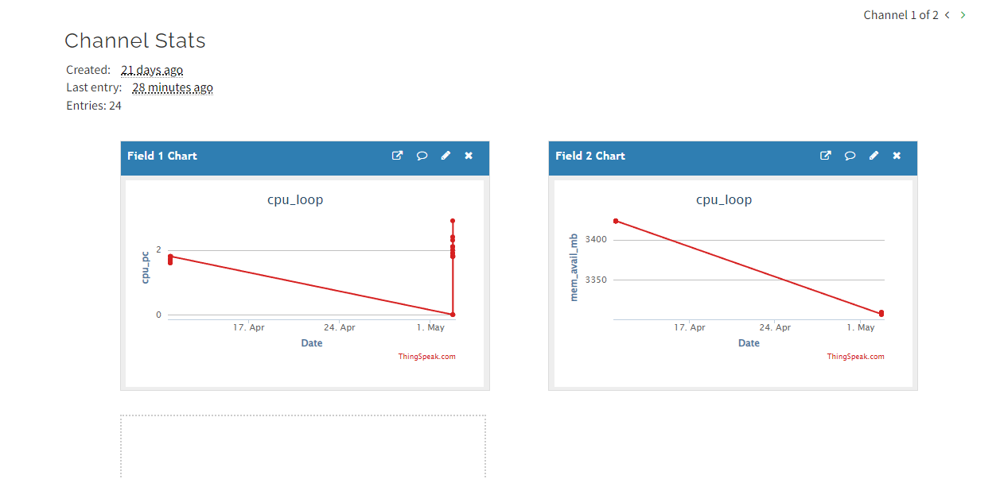
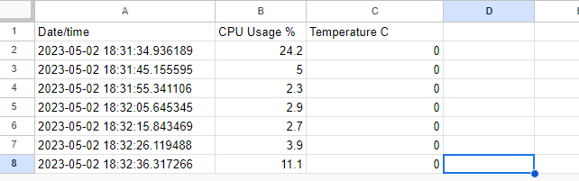

# Lab 7
## Thinkspeak
After signing up and creating the Thingspeak module, I run the following code to copy and establish connection with thingspeak using the supplied API key.
```
$ sudo pip3 install -U psutil
$ cd ~/demo
$ cp ~/iot/lesson7/thingspeak_cpu_loop.py .
$ cp ~/iot/lesson7/thingspeak_feed.py .
$ cat thingspeak_cpu_loop.py
$ cat thingspeak_feed.py
$ python3 thingspeak_feed.py
```
Here is a screencap of the file runing (There was a break inbetween data collections which results in a poorly formatted graph)

After this, utilizing Google IAM, I was able to use the Google API to write data into a google sheet.
